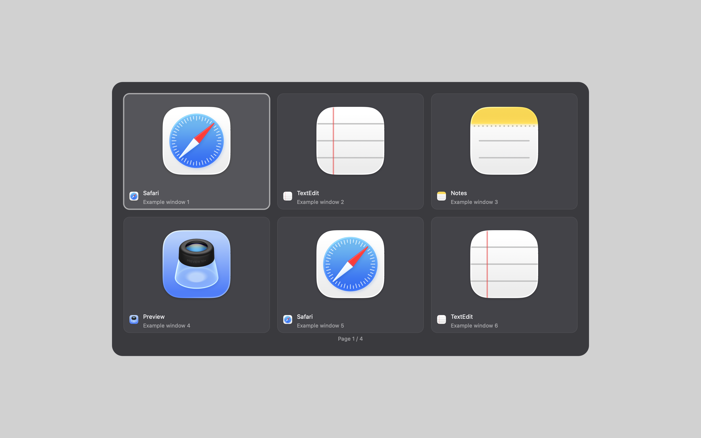
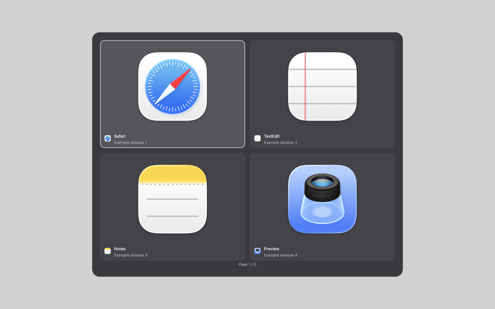
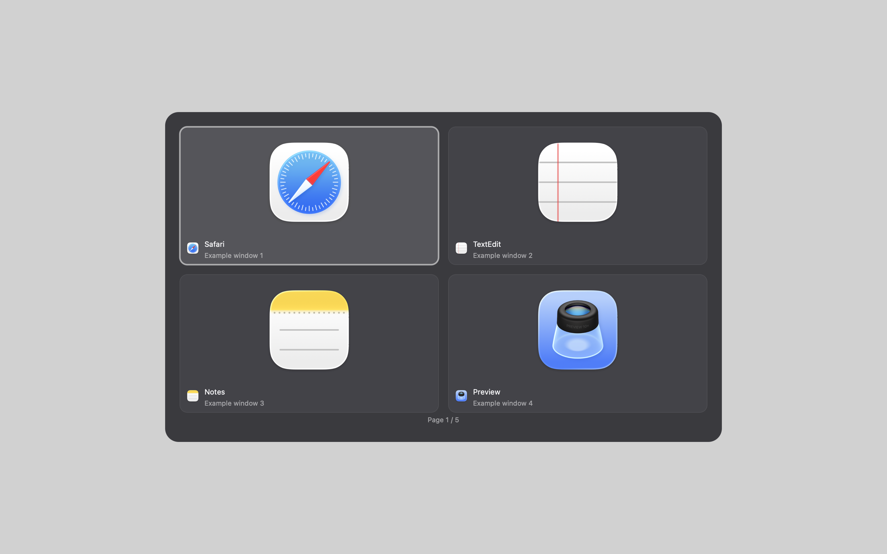
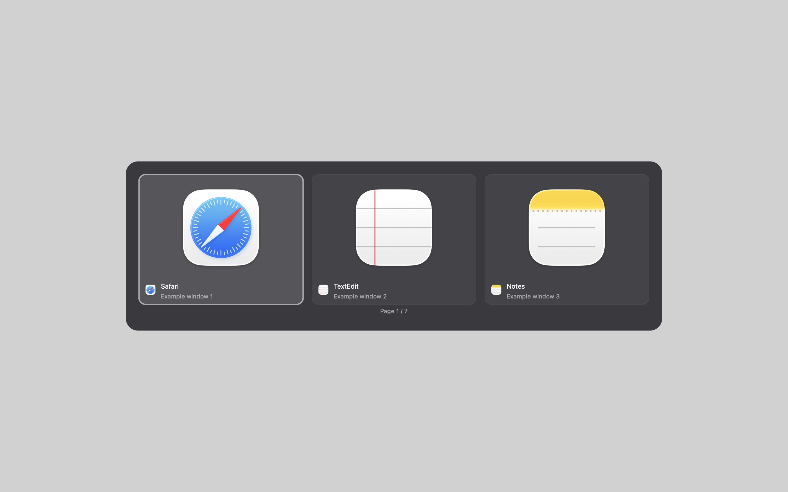
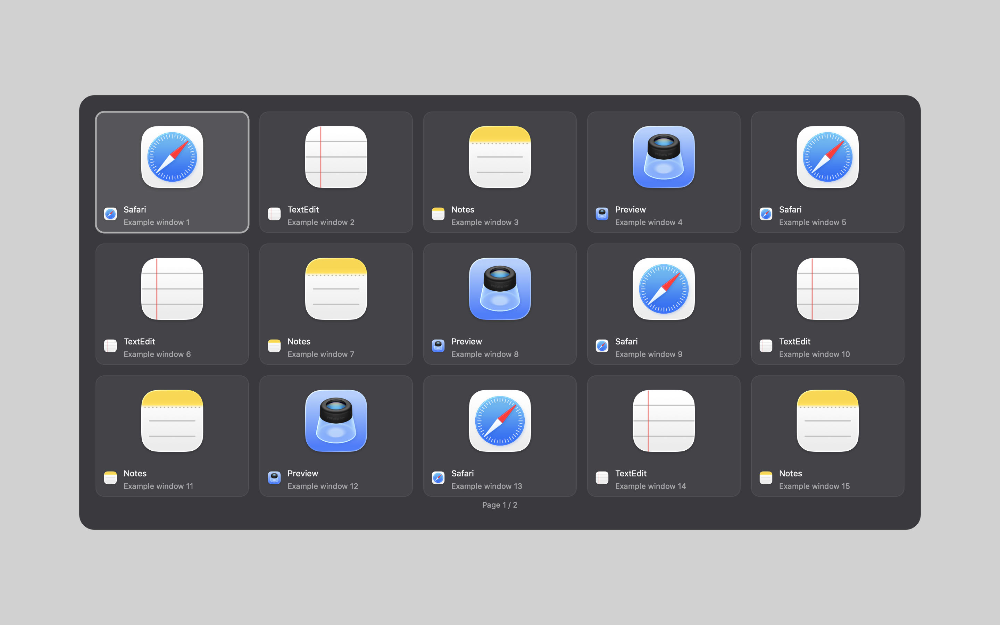

# Window Switcher for Hammerspoon

Too many windows from the same app? Cmd+Tab shows individual windows with thumbnails when available, with other-Space windows included where Hammerspoon exposes them. Choose with the keyboard or mouse, then release Cmd to jump to your choice. Recent windows come first, making two documents as easy to switch between as two apps.

This standalone configuration contains the window switcher only. Its editable `CONFIG` section has comments explaining every setting, including what increasing or decreasing a numeric value changes. Six presets cover a regular grid, larger cards, wide previews, one row, two rows and a compact grid.

## Demo

[Watch the recorded window-switching demonstration (MP4, 20 seconds)](demo/window-switcher.mp4)

## Install

1. Install [Hammerspoon](https://www.hammerspoon.org/) for macOS. This file uses its Lua runtime.
2. Back up your current `~/.hammerspoon/init.lua`.
3. Download this repository's `init.lua`, rename it to `window-switcher.lua`, and save it in `~/.hammerspoon/`.
4. Add this line to your existing `init.lua`:

```lua
require("window-switcher").start()
```

5. Grant Hammerspoon **Accessibility** permission in System Settings, then choose **Reload Config** in its menu.
6. Grant **Screen Recording** permission if you want window thumbnails and macOS requests it. Set `showThumbnails = false` for icon-only cards without window capture.

Disable any other switcher using the same shortcut before starting this one. Set `triggerModifier = "alt"` to use Option+Tab and keep native Cmd+Tab available.

For a fresh Hammerspoon setup with no existing configuration, you can instead save the supplied file directly as `~/.hammerspoon/init.lua`; it starts automatically in that case. Do not replace an existing configuration unless you intend to replace its other features too.

The file returns its module without starting when loaded by name. To remove the module, remove the `require` line and reload your configuration, then remove `window-switcher.lua` if you no longer need it.

## How it works

- Hold **Cmd** and press **Tab** to open the panel. The initial choice is the previous window; keep pressing Tab to move forward. **Shift+Tab** moves backward. Release Cmd to focus your choice.
- Use **Left/Right** to move one card, **Up/Down** to move one row. Navigation wraps around the complete window list and automatically changes pages.
- Move the mouse at least `mouseThreshold` pixels to enable hover selection. Click a card to focus it.
- **Enter** or **Space** confirms the selection. **Escape** cancels. Clicking outside the panel cancels.
- **Ctrl+Option+Space** opens a sticky panel. It stays open until you confirm or cancel; releasing modifiers does not select a window in this mode.
- `triggerModifier = "alt"` uses **Option+Tab** and leaves the native Cmd+Tab shortcut available.

Windows are sorted by recent focus. The switcher lists visible standard windows, with each window represented separately. It does not list minimized windows. With `includeOtherSpaces = true`, other Spaces are included where Hammerspoon exposes their windows; those windows use application icons instead of being captured.

The panel opens on the focused window's screen, falling back to the mouse's screen. Clicking the panel avoids activating unrelated Hammerspoon windows. Key interception queues UI work for later, so the input handler can return immediately.

## Choose a look

Change only `preset` near the beginning of `init.lua`, then reload:

```lua
preset = "one-row",
```

| Preset | Card width | Preview height / width | Layout |
|---|---:|---:|---|
| `default` | 300 points | 0.62 | Automatic grid |
| `large` | 420 points | 0.62 | Larger grid cards |
| `wide` | 420 points | 0.40 | Wide, short previews |
| `one-row` | 300 points | 0.62 | One horizontal row per page |
| `two-rows` | 300 points | 0.62 | Two rows per page when screen space permits |
| `compact` | 220 points | 0.55 | Smaller cards, more per page |

A `nil` value for `cardWidth`, `thumbnailAspect`, `layout`, `rows` or `columns` uses the selected preset. Explicit values override it. Every other setting keeps the value written in `CONFIG`.

For example, keep two rows but make the cards wider:

```lua
preset = "two-rows",
cardWidth = 380,
thumbnailAspect = 0.45,
```

Or choose three columns:

```lua
layout = "columns",
columns = 3,
```

These are edits to entries inside `CONFIG`, not a second configuration table. Reload after editing.

Fixed rows/columns paginate when more windows exist than fit on screen. The highlighted card moves onto its page automatically. A small screen may reduce the requested row/column count or shrink cards to keep them inside the available area. Screen fractions are targets; a minimum readable footprint can override them on very small screens. The label area automatically grows if larger text or icons need it.

## Settings reference

The code comments are the complete parameter guide, beside the values you edit.

| Settings | What they control |
|---|---|
| `preset`, `cardWidth`, `thumbnailAspect`, `layout`, `rows`, `columns` | Starting design, card size and arrangement |
| `screenWidth`, `screenHeight`, `minimumCardWidth`, `cardGap` | Screen coverage, readability and spacing |
| `panelPadding`, `panelRadius`, `cardRadius`, `imagePadding`, `footerHeight` | Outer margins, rounding, preview padding and label area |
| `appTextSize`, `titleTextSize`, `iconSize`, `pageTextSize`, `font` | Label, icon and page-number sizes and font |
| `backdropColor`, `panelColor`, `panelBorderColor` | Background and panel colors |
| `cardColor`, `cardBorderColor`, `selectedCardColor`, `selectedBorderColor` | Ordinary and selected card colors |
| `appTextColor`, `titleTextColor`, `cardBorderWidth`, `selectedBorderWidth` | Text colors and border thickness |
| `includeOtherSpaces`, `showThumbnails` | Window scope and previews versus icons |
| `triggerModifier`, `commitOnRelease`, `stickyModifiers`, `stickyKey` | Shortcuts and confirmation behavior |
| `mouseThreshold`, `releasePoll` | Mouse takeover threshold and release response |
| `thumbnailCacheSeconds`, `thumbnailScale`, `prewarmThumbnails`, `prewarmInterval` | Image freshness, quality, memory use and background capture |
| `watchdogInterval`, `stuckPanelSeconds` | Recovery if macOS disables the key tap or a held-modifier panel gets stuck |

RGBA colors are four numbers from 0 to 1. Increase a red/green/blue channel to add that color; lower it to remove that color. Increase all three together to lighten. Increase alpha for a more opaque surface; lower it for more transparency.

There are no server endpoints, account credentials, clipboard history, uploads, recording adapters or vault links in this switcher.

## Preview gallery

These are native Hammerspoon canvas exports using synthetic example windows and application-icon placeholders. They show layout and styling, not the contents of anyone's desktop. Live window thumbnails depend on macOS permissions and capture availability.

### Default


### Larger cards


### Wide cards


### One row


### Two rows


### Compact


## Troubleshooting

If nothing opens, enable Accessibility and reload. If Cmd+Tab feels intercepted twice, disable your other window switcher or the switcher in the full configuration. If thumbnails are missing, grant Screen Recording or use icon-only cards.

To stop this switcher temporarily from Hammerspoon's console:

```lua
PavelWindowSwitcher.stop()
```

To start it again:

```lua
PavelWindowSwitcher.start()
```

To return to your previous configuration, restore the backup and reload. The switcher releases its own tap, hotkey, timers and focus callback on stop or shutdown; it does not unsubscribe other modules' callbacks.

## Verification

The configuration compiles with installed Hammerspoon 1.1.1. Isolated checks cover all six presets, 180 screen/window-count combinations, explicit columns, size/aspect changes, pagination, keyboard selection, deferred opening, cancellation and cleanup. Preview images are rendered by the actual Hammerspoon canvas API, off screen. These checks do not replace a live interaction test on your Mac.

Created by Pavel Potasuev. This repository contains the standalone window switcher.
